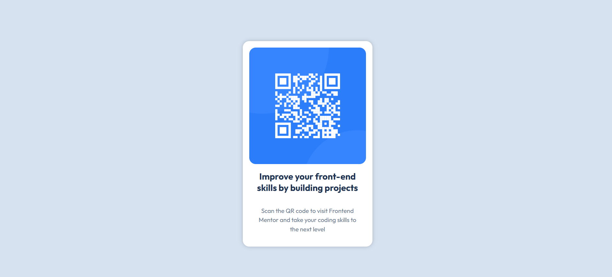

# Frontend Mentor - QR code component solution

This is a solution to the [QR code component challenge on Frontend Mentor](https://www.frontendmentor.io/challenges/qr-code-component-iux_sIO_H). Frontend Mentor challenges help you improve your coding skills by building realistic projects. 

## Table of contents

- [Overview](#overview)
  - [Screenshot](#screenshot)
  - [Links](#links)
- [My process](#my-process)
  - [Built with](#built-with)
  - [What I learned](#what-i-learned)
  - [Continued development](#continued-development)
  - [Useful resources](#useful-resources)
  - [AI Collaboration](#ai-collaboration)
- [Author](#author)

## Overview

### Screenshot



### Links

- Solution URL: [https://github.com/guiesculapio/qr-code-component](https://github.com/guiesculapio/qr-code-component)
- Live Site URL: [https://guiesculapio.github.io/qr-code-component/](https://guiesculapio.github.io/qr-code-component/)

## My process

### Built with

- Semantic HTML5 markup
- CSS custom styles com unidades rem
- Flexbox

### What I learned

What I'm learning: I'm getting a better understanding of how px-to-rem conversion works—specifically that 1rem = 16px—and I've learned that rem adapts better to the root element, whereas px is fixed.


```css
.titulo {
  font-size: 1.375rem;
}
```

I also learned the correct way to use `gap`: always on the parent element, because it controls the spacing between its internal elements (children).

```css
.card {
  gap: 1rem;
}
```

### Continued development

I want to refine my general front-end skills; right now, I plan to improve my knowledge of units and Flexbox.

### Useful resources

- [Origamid](https://www.origamid.com) - The HTML and CSS course gave me the foundation I needed to build this project, including Flexbox and Google Fonts.
- [style-guide.md](./style-guide.md) - It provided the color palette, font, font sizes and layout widths I followed to match the design.

### AI Collaboration

I used Claude as a learning partner during this project. I used it to:

- Ask questions when I was stuck
- Review the code I wrote
- Get hints and guidance instead of ready-made answers

Everything worked well. Because Claude guided me step by step instead of writing the code for me, I wrote the solution myself and understood the reasoning behind each decision.

## Author

- Website - [Guilherme ](https://guiesculapio.github.io/)
- Frontend Mentor - [@guiesculapio](https://www.frontendmentor.io/profile/guiesculapio)